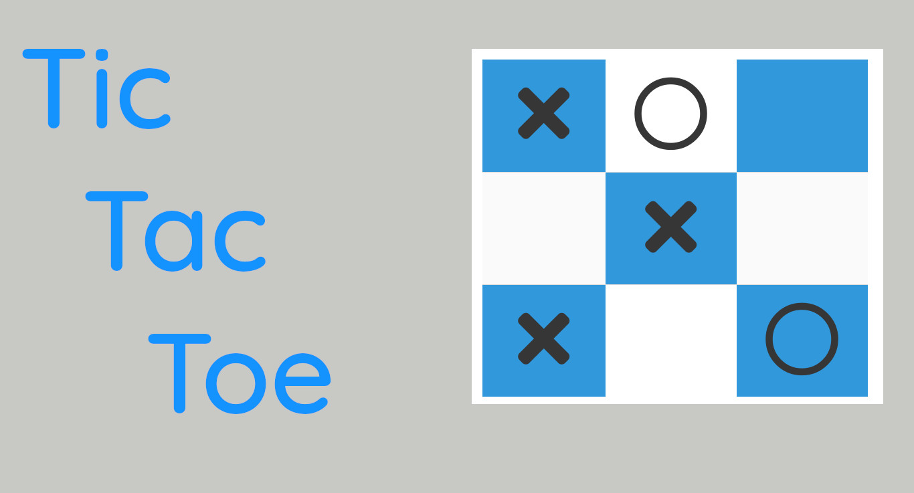
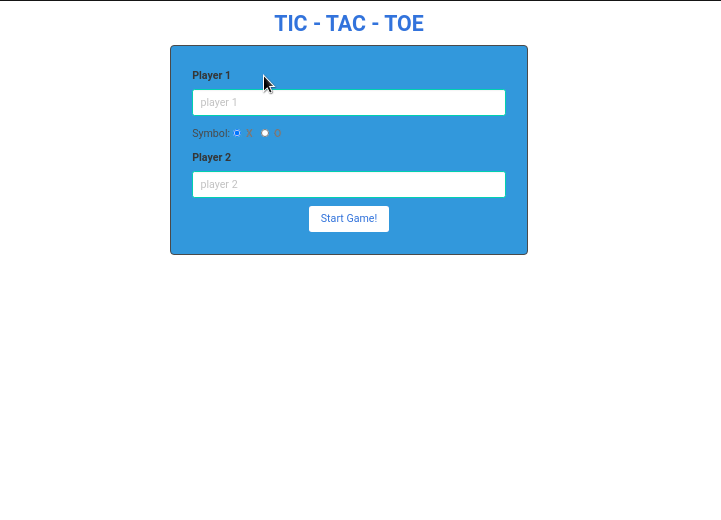

<!-- Badges -->
<p>
  
  <a href="#" target="_blank">
    
  </a>
  <a href="https://twitter.com/redacuve" target="_blank">
    
  </a>
</p>


<!-- Project Header -->
  <p align="center">
    
  <br>
  <h1 align="center">Project Tic Tac Toe</h1>
  <p align="center">
  <br>
   <a href="https://github.com/redacuve/Tic-Tac-Toe-JS"><strong>Explore the repo »</strong></a>
  <br>
    <a href="https://github.com/redacuve/Tic-Tac-Toe-JS/issues">Request Feature</a>
  </p>
  <h2 align="center"><a href="https://raw.githack.com/redacuve/Tic-Tac-Toe-JS/development/dist/index.html"><strong>Live Link!</strong></a></h2>

<!-- TABLE OF CONTENTS -->

## Table of Contents

* [About the Project](#about-the-project)

* [Built With](#built-with)

* [Getting Started](#getting-started)

* [How it Works](#how-it-works)

* [Contributing](#contributing)

* [License](#license)

* [Contact](#contact)

<!-- ABOUT THE PROJECT -->

## About The Project

This a Tic Tac Toe Game, It's build with vanilla Javascript.

It uses webpack to be able to import other files.

This game allows you to play with a friend, It's very fun, also you can reset the game or start a new one.

It is based in a previous collaborative project, link <a href="https://github.com/ricardovaltierra/JS-Tic-Tac-Toe/">Here</a>

For more details about this project and it's requeriments go to <a href="https://www.theodinproject.com/courses/javascript/lessons/tic-tac-toe-javascript"> The Odin Project</a>

<p align="center">
  
</p>

### Built With

* [HTML5](https://developer.mozilla.org/en-US/docs/Web/Guide/HTML/HTML5)

* [CSS](https://developer.mozilla.org/en-US/docs/Web/CSS)

* [Javascript](https://developer.mozilla.org/en-US/docs/Web/JavaScript)

* [Bulma](https://bulma.io/documentation)

<!-- GETTING STARTED -->

## Getting Started

To get a local copy up and running follow these simple steps.

Clone or fork the <a href="https://github.com/redacuve/Tic-Tac-Toe-JS">repo</a> [git@github.com:redacuve/Tic-Tac-Toe-JS.git]

*note you need have install npm or yarn
* [npm](https://www.npmjs.com/get-npm)
* [yarn](https://classic.yarnpkg.com/en/docs/install)


<!-- HOW IT WORKS -->
## How it Works

This game is built with various .js files, these files are located inside the /src folder, here we can find:
    * domHandler.js This files controls the flow of data between the DOM and the game, we can obtain data from the DOM and we can update data in the DOM.
    * gameboard.js This is a factory function of a gameboard, we can create one only with two player objects.
    * helperFunctions.js Here are located all external functions (they are pure) that help us to calculate some data.
    * index.js In this file are all of the logic of the game, here is where the listeners are declared.
    * player.js a factory function that retrieves us a player object, it needs a name and symbol to start to work.

### Running the code

*   Navigate to the root directory of the project

*   Run this command on your terminal to add all the required packages and dependencies
    ```
    $ npm install
    ```
*   Also, you can build this webpage for production, this app it's going to be saved inside the /dist folder, here we can see a main.js file, this is a minified file of the previous files o¿inside /src folder.
    ```
    $ npm run build
    ```
*   Now the app is ready, you can open the index.html inside /dist folder.


<!-- CONTRIBUTING -->

## Contributing

Contributions are what make the open source community such an amazing place to be learn, inspire, and create. Any contributions you make are **greatly appreciated**.

1. Fork the Project

2. Create your Feature Branch (`git checkout -b feature/AmazingFeature`)

3. Commit your Changes (`git commit -m 'Add some AmazingFeature'`)

4. Push to the Branch (`git push origin feature/AmazingFeature`)

5. Open a Pull Request

<!-- LICENSE -->

## License

This project is under the <a href="https://www.gnu.org/licenses/gpl-3.0.html">GNU Public License V3</a>. For more information see <a href="https://github.com/redacuve/Tic-Tac-Toe-JS/blob/master/LICENSE">here</a>

<!-- CONTACT -->

## Contact

Rey David Cuevas Vela - [@redacuve](https://twitter.com/redacuve) - [redacuve@gmail.com](mailto:redacuve@gmail.com) -[linkedin.com/in/redacuve/](https://www.linkedin.com/in/redacuve/)

Project Link: [github.com/redacuve/Tic-Tac-Toe-JS](https://github.com/redacuve/Tic-Tac-Toe-JS) - Tic Tac Toe Project.
